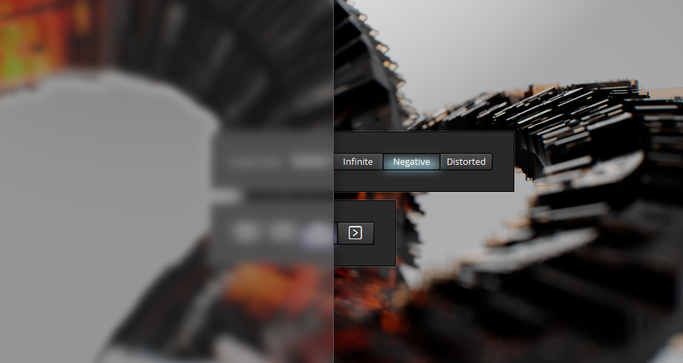
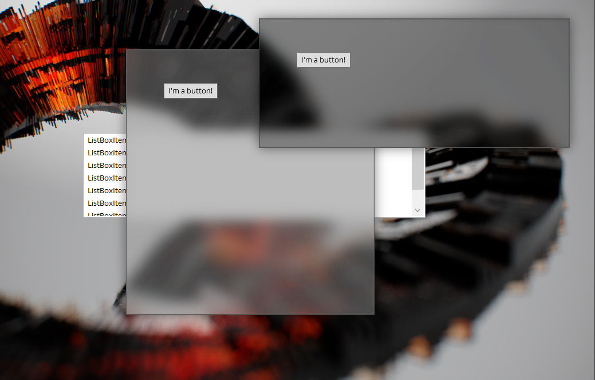
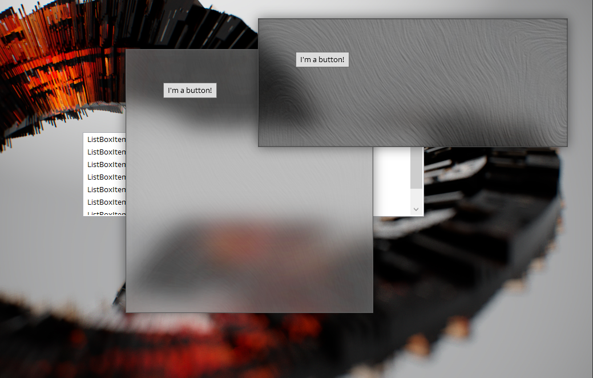

# WPF.Materials
A WPF implementation of the new "Materials" in UWP / Fluent Design. The initial library will contain Acrylic, Paint, Smoke, and Metal, with more materials added later.

This WPF library consists of a primary Custom Control and several styles - each style gives you access to different materials.

## Using WPF.Materials
See [the usage guide](Examples.md) for usage instructions and examples.

## Acrylic Material

An `AcrylicContainer` over normal WPF controls.

Low blur.

High blur value.

## Paint Material

Simulated "oil paint" effect.

## Smoke Material
Coming soon

## Metal Material
Coming soon

## Glass Material
Coming soon
